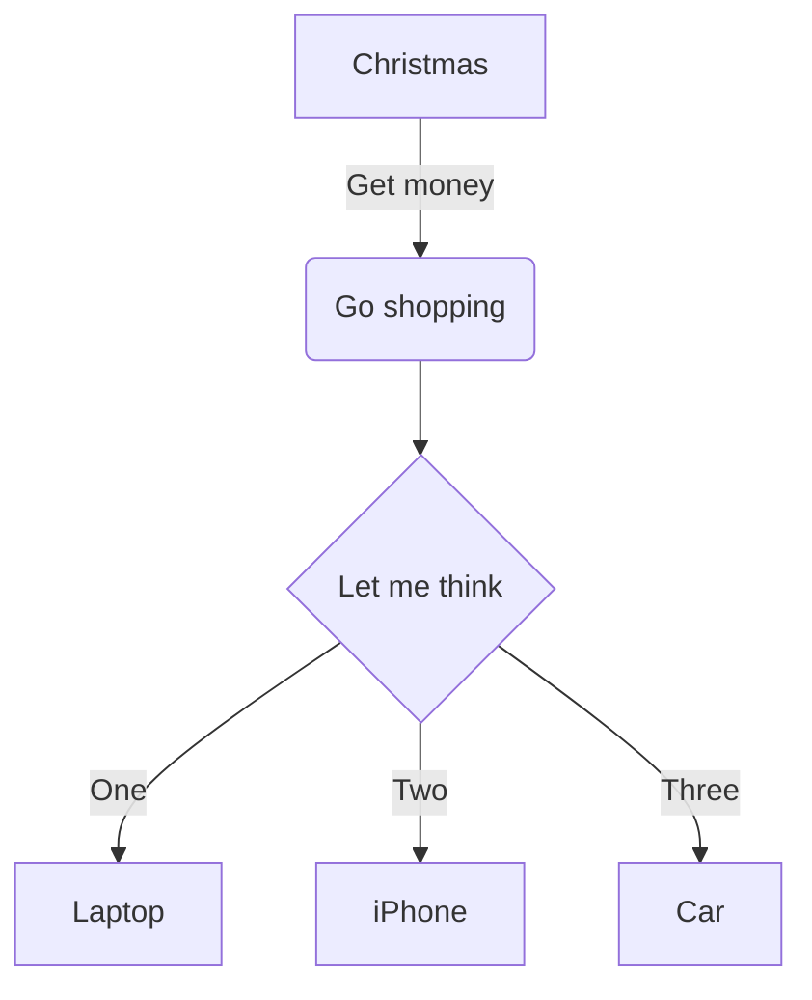
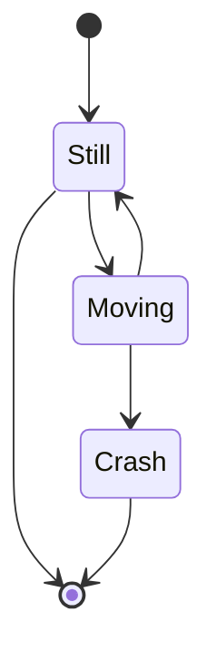
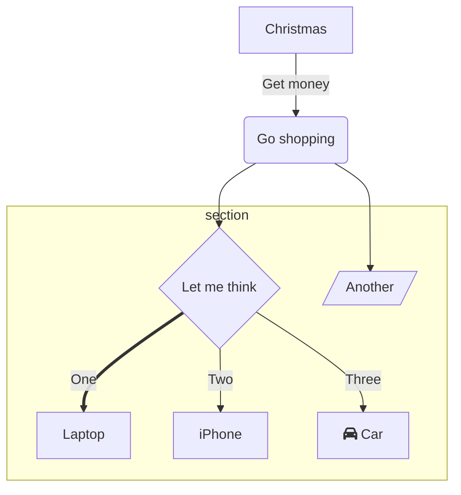

# markdown-it rulezz!

This is **bold** and this is _italic_ and this is **_bold and italic_**

This is ==highlighted==

- And this is a list
- With two items This is a

[link](https://www.google.com)

This is a footnote[^1]

[^1]: This is a footnote

This is a `code` block

```javascript
console.log('hello world');
```

```python
print('hello world')

# This is a comment
class MyClass:
  def __init__(self):
    print('hello world')

    def my_method(self):
        print('hello world')

for i in range(10):
    print(i)
```

This is a blockquote

> This is a blockquote \
> With two lines This is an image


## This is a table

| Item              | In Stock | Price |
| :---------------- | :------: | ----: |
| Python Hat        |   True   | 23.99 |
| SQL Hat           |   True   | 23.99 |
| Codecademy Tee    |  False   | 19.99 |
| Codecademy Hoodie |  False   | 42.99 |

This is a horizontal rule

---

This is an inline equation: $x^2 + y^2 = z^2$

This is a block equation

$$ x^2 + y^2 = z^2 $$

$$
\begin{array}{c}

\nabla \times \vec{\mathbf{B}} -\, \frac1c\, \frac{\partial\vec{\mathbf{E}}}{\partial t} &
= \frac{4\pi}{c}\vec{\mathbf{j}}    \nabla \cdot \vec{\mathbf{E}} & = 4 \pi \rho \\

\nabla \times \vec{\mathbf{E}}\, +\, \frac1c\, \frac{\partial\vec{\mathbf{B}}}{\partial t} & = \vec{\mathbf{0}} \\

\nabla \cdot \vec{\mathbf{B}} & = 0

\end{array}
$$

This is a subscript: H~2~O \
This is a superscript 29^th^






